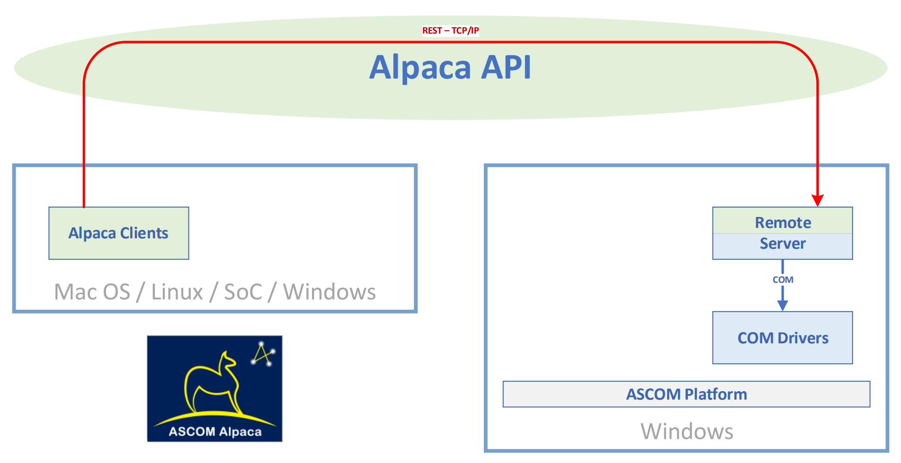

## 概述

计划在这里记录一些自己尝试在linux下控制ASCOM设备的方案与接触这些内容时的趣事

笔者接触ASCOM大概是在2022年3月份，第一次接触时仅大概了解了ASCOM的定义与ASCOM在windows下的驱动如何撰写。笔者在彼时是一个热衷于使用linux系统来对硬件设备进行控制的选手，当时内心便存有困惑，即如何使用linux来撰写ASCOM的驱动，但是受限于当时的时间与精力限制，不得已暂时搁置了该困惑。

所幸之事是时光过去不过五六个月，便遇到了需兼容在linux下控制ASCOM设备的硬需求，便重拾了ASCOM的基础知识，顺带补习了ASCOM Platform6.5平台对于ASCOM的更新之处，进一步跑通了ASCOM官方在文档里的Demo（顺带还改了改），谨在此进行记录，希望能帮助以后调试ASCOM Remote与ASCOM Alpyca的同僚少走弯路，直指本质，同时在此记录调试期间的一些趣事，以致敬我和至今为止已在趣事中出现的X哥等人那些一起熬过的夜、通过的宵和终将逝去的青春。

## 笔者简介

笔者国内某校研究生在读，与大家一样，正在努力挣扎毕业<叹气emoji>  
小论文还没发，大论文感觉工作量和创新点还远远不够  
毕业倒计时两年半，希望能按时毕业  
研究方向大概在望远镜和科研级相机惹，大家如果有什么好发论文的方向捞捞我捞捞我，球球了<手动挥爪emoji>  

## 趣事随记

<mark>xx年xx月xx日</mark>  
<mark>x哥调试某原生驱动至深夜，精神状态不佳，笔者已完成手头另一项原生驱动调试，遂发生以下对话</mark>  
<mark>笔者：x哥，你咋了</mark>  
<mark>x哥：调不出来啊，凉了啊</mark>  
<mark>笔者：x哥，现在是11点40，我现在一行代码都还没写，你信不信我能在12点前把这个东西在Linux下用ASCOM调出来</mark>  
<mark>x哥：我不信</mark>  
<mark>笔者：那说好了，如果我调出来了我就能拿这事笑你半年</mark>  
<mark>12点05分，x哥看着测试完成的设备陷入了沉思</mark>


<mark>xx年xx月xx日</mark>  
<mark>深夜与x哥进行观测，奈何当日光污染较严重，笔者仰头对天，嘛星星都看不到</mark>  
<mark>笔者：x哥，救命啊，我一颗星都看不到啊</mark>  
<mark>x哥：等会儿啊</mark>  
<mark>笔者：救命啊</mark>  
<mark>x哥出，肉眼对之，辅以指挥我左左右右上上下下，视场中有了星象</mark>  
<mark>笔者感受：人与人的动态范围并不相通</mark>  
<br>

## 正文

在过去的若干时间中，我们只能在windows下开发ASCOM驱动，驱动ASCOM设备，但是当ASCOM Platforn6.5问世后，为我们在linux下驱动ASCOM设备提供了很好的支持，官方为ASCOM在linux下的驱动开发共提供了两种（或者可能三种）方案：
1. 跨平台的.NET方案，采用C#来coding
2. 组织为python库形式的alpyca方案，采用python来coding
3. 笔者没搞明白怎么写的C++方案，采用C++来coding
笔者是一个热爱C++的编程选手，故刚开始意欲采用第三种方案进行coding，奈何水平有限，没能找到该如何下手，同时，由于笔者对于C#的认知有限，故没有采用第一种方案，转而采用了python接口的alpyca方案，实测alpyca并未让笔者失望，成功地把望远镜控了起来。

在开始写如何写代码控制硬件设备以前，我们需要先来介绍一下ASCOM设备控制的整体架构，根据设备不同的分布情况在这里将情况分为两种：
1. 设备所接的与控制软件所运行的电脑为同一台电脑
2. 设备所接的与控制软件所运行的电脑为不同电脑

在笔者的调试过程中，遇到的情况更为复杂，笔者在调试之初所遇到的情况是第一种情况，但是出现了设备并不提供该电脑平台的ASCOM驱动的情况，故不得已之下笔者采用了第二种方案。

笔者的整体环境为一台windows电脑，一台linux电脑，望远镜与相机等设备提供了windows下的ASCOM驱动支持，但是并没有提供linux下的ASCOM驱动支持，故笔者在调试时采用了ASCOM Remote与ASCOM Alpyca的方案来进行调试，即将望远镜、相机等设备均接至windows设备下，控制程序部署于linux上，通过ASCOM Remote对请求进行转换，进一步实现对设备的控制，同时这种架构方式也是ASCOM官方为我们介绍的“Alpaca clients using COM drivers hosted on a Windows PC”架构，其整体架构图如下，图源ASCOM官方文档：


即在linux下的Alpaca Clients通过Alpaca API将信息传递给运行在windows平台上的ASCOM Remote Server，Remote Server解析消息后将信息传递给COM Drivers进行控制。

<br>
接下来就是实际写代码这一步，其实开始到了上手写代码的时候反而没有那么难了，ASCOM的官方文档给出了十分完善的指南（[https://ascom-standards.org/alpyca/](https://ascom-standards.org/alpyca/)）。我们所要撰写的部分，其实仅仅只有Alpaca Clients部分的代码，其他部分的代码均由ASCOM Platform与各仪器厂商帮我们完成了，我们仅需按照ASCOM官方文档的指南，首先运行：
```shell
pip install alpyca
```

在完成了python库的安装后，我们可以新建一个.py文件，然后将官方的Simple Example复制进来
```python
import time
from alpaca.telescope import *      # Multiple Classes including Enumerations
from alpaca.exceptions import *     # Or just the exceptions you want to catch

T = Telescope('localhost:32323', 0) # Local Omni Simulator
try:
    T.Connected = True
    print(f'Connected to {T.Name}')
    print(T.Description)
    T.Tracking = True               # Needed for slewing (see below)
    print('Starting slew...')
    T.SlewToCoordinatesAsync(T.SiderealTime + 2, 50)    # 2 hrs east of meridian
    while(T.Slewing):
        time.sleep(5)               # What do a few seconds matter?
    print('... slew completed successfully.')
    print(f'RA={T.RightAscension} DE={T.Declination}')
    print('Turning off tracking then attempting to slew...')
    T.Tracking = False
    T.SlewToCoordinatesAsync(T.SiderealTime + 2, 55)    # 5 deg slew N
    # This will fail for tracking being off
    print("... you won't get here!")
except Exception as e:              # Should catch specific InvalidOperationException
    print(f'Slew failed: {str(e)}')
finally:                            # Assure that you disconnect
    print("Disconnecting...")
    T.Connected = False
```

保存退出后执行：
```shell
python xxx.py # xxx.py为前文中对于Simple Example的命名
```

然后就能看到望远镜快乐地转了起来  
<mark><b>慎用，用以前确保有专业人士在场，可及时处理各种突发情况，比如碰撞到杂物等等，由于各望远镜情况的不同，笔者对该代码运行可能产生的结果无法保证且概不负责</b></mark>

关于其他各API的使用大家可参考Alpyca的官方文档，链接[https://ascom-standards.org/alpyca/](https://ascom-standards.org/alpyca/)